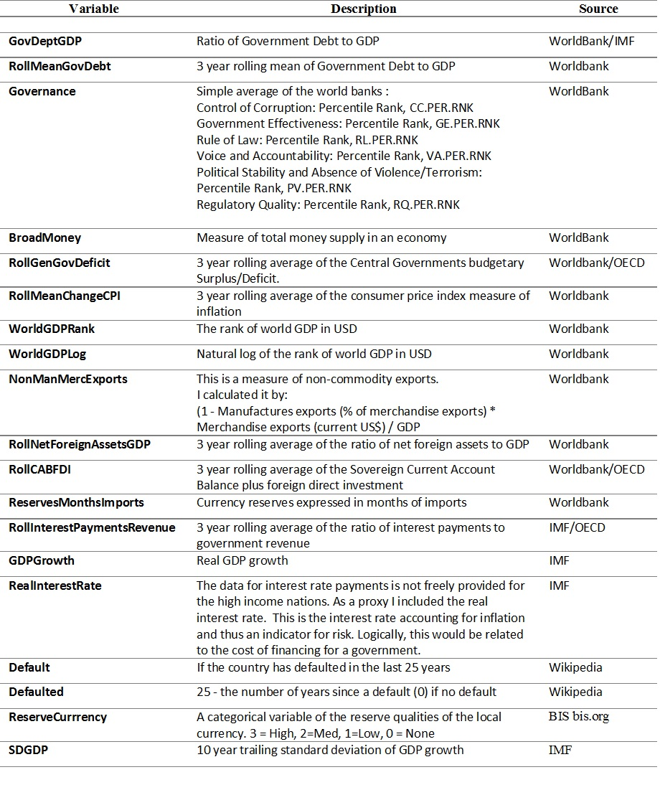

#Overview

In this project I will investigate reverse engineering the method that the Fitch Credit Rating Agency uses to create their Sovereign Credit Ratings. After analysis of the relevant variables I will use various machine learning techniques to allow the data to tell the story. My motivation includes an interest in the almost commoditisation and disintermediation of traditionally specialised analysis, through the availability of open data and the widespread availability of sophisticated computing power. This process will also allow me to explore this idea using Linear regression, k-nearest neighbour, gradient boosted trees and ensembling. 

During the GFC in 2007, Australia managed to maintain its AAA credit rating and used this to guarantee the deposits in our banks. This was very important to the maintenance of the Australian economy through ensuring the availability of low yield foreign lending. However, the head of research for one of the big for banks in Australia wrote a recent report stating that Australia faces an upcoming Federal election with Commonwealth debt already "pushing against ratings agencies' AAA boundary". The risk to Australia of a reduction in its credit rating would be associated with increased cost to finance Governmental operations through bonds. In relating this to my investigation, are there insights that can be drawn from the method of calculating credit risks that can help Australia maintain her credit rating? Moreover, can these insights from the calculation methodology be applied to evaluating why some countries rate better than others?

My literature review indicates that statistical analysis using economic theory was performed for S&P and Moody ratings in [1996](https://www.newyorkfed.org/research/epr/96v02n2/9610cant.html) and later for the Big Three in [2003](https://www.imf.org/external/pubs/ft/wp/2003/wp03122.pdf). In this project I will update this research for Fitch with new data and complement it by utilising machine learning.


#Introduction

A government has various ways to raise funds such as taxation, selling assets or debt. Bonds are either denominated in the local currency or a foreign currency. The bond repayments are split into principle and interest payments. The principle is paid at the maturity of the bond with scheduled interest payments. I will be looking at the credit ratings for the issuing of long term securities in the form of 10 year bonds in a sovereign's local currency.

Three broad categories of bonds risks are:

* Credit Risk
* Currency Risk
* Inflation Risk 


Sovereign credit risk is the risk of a government becoming unwilling or unable to meet its debt obligations. A government may have a restructured default (rescheduling of payments) or a full default. The expected value of a loss is proportional to the probability of a default and the amount recovered in the case of a default. Much like a haircut can range from a little off the top, to the [el Greco Kojak](https://www.youtube.com/watch?v=-8hbUqhKM38) ("who loves ya baby?" - no one, you owe us money). 


Interestingly, securities are the mechanism used to 'print money'. By a central bank purchasing its government's bonds, it increases the money supply, resulting in the creation of money.

A government will engage a credit agency to rate its bonds. These ratings are used to assess the risk of the bonds, whereby the level of risk will dictate the interest rate premium. Credit ratings agencies are independent and are paid by the sovereign nation to provide an impartial service. As part of the arrangement the sovereign nation will agree to private information sharing.


Of the big three rating agencies (S&P, Moody's, and Fitch) I will be examining Fitch's ratings as they have made their ratings from 1994-2012 [publicly available](https://www.fitchratings.com/web_content/ratings/sovereign_ratings_history.xls) . In the interest of transparency they have also made an overview of their current methodology available [here](https://www.fitchratings.com/site/criteria/pfsov.html).

I will be looking at local currency ratings which should be the apex of the credit rating compared to foreign currency credit ratings. If a sovereign's economy worsens then a country's local currency may depreciate in relation to the denomination of foreign currency securities, thus increasing the risk of a default. Simply, less capacity to pay a higher relative debt amount.


The below table indicates the credit ratings and their associated categories and grades. AAA is the prime rating. I will be encoding the ratings where AAA = 1, AA+ =2, AA = 3 and so forth. Strictly speaking there is the D/RD ratings that indicate that a country is defaulting. I have not included these as that is not a prediction but rather an indicator of what has happened.

 


```{r  echo = FALSE, message=FALSE, warning=FALSE}
###Loading Libraries####
library(tidyr)
library(dplyr)
library(ggplot2)
library(readr)
library(lubridate)
library(caret)
library(xgboost)
library(rworldmap)
library(ggplot2)
library(radarchart)
library(reshape2)
library(ggrepel)
library(knitr)


```


```{r  echo = FALSE, message=FALSE, warning=FALSE}

#Convert World Bank data from wide to long
TidyUpWorldBank <- function(df_WorldBank) {
  
  i <- as.integer(dim(df_WorldBank)[2]) - 3

  df_WorldBank <- df_WorldBank %>% 
    select(-`Country Code`, -`Indicator Name`) %>%
    unite(WBI, `Country Name`,`Indicator Code`, sep = "#", remove = TRUE) %>%
    gather("Year", "n", 2:i) %>%
    separate(WBI, c("Country","Indicator"), sep = "#") %>%  
    mutate(Year = as.numeric(Year)) %>%
    filter(!is.na(n)) %>%
    mutate(n = as.numeric(n))

  df_WorldBank <- df_WorldBank %>%
    group_by(Country, Year) %>%
    spread(Indicator, n) %>%
    ungroup()

  return(df_WorldBank)
}

WhenDidYouDefault <- function(df, i, j) {
  forgiveness = 25 #How long until the default is forgiven
  k <- i - forgiveness
  d <- length(df$Default[df$Country == j & df$Default < i] & df$Default >= k)
  if(d){d<-(max(df$Default[df$Country == j & df$Default < i])-i+forgiveness)}
  return(d^2)
  
}

EncodeRating <- function(y) {

  y<-ifelse(y == "AAA",1, 
    ifelse(y == "AA+", 2,
      ifelse(y=="AA",3,
        ifelse(y=="AA-",4,
          ifelse(y=="A+",5,
            ifelse(y=="A",6,
              ifelse(y=="A-",7,
                ifelse(y == "BBB+", 8,
                  ifelse(y == "BBB", 9,
                    ifelse(y == "BBB-", 10,
                      ifelse(y == "BB+", 11,
                        ifelse(y == "BB", 12,
                          ifelse(y == "BB-", 13,
                            ifelse(y == "B+", 14,
                              ifelse(y == "B", 15,
                                ifelse(y == "B-", 16,
                                  ifelse(y == "CCC+", 17,
                                    ifelse(y == "CCC", 18,
                                      ifelse(y == "CCC-", 19,   
                                        ifelse(y == "CC", 20,
                                          ifelse(y == "C", 21,
                                            NA)))))))))))))))))))))
  
  return(y)
}

#Function to encode whether a bond is investment of non-investment grade (Junk)
EncodeJunkBonds <- function(y) {

  y<-ifelse(y == "AAA",0, 
    ifelse(y == "AA+", 0,
      ifelse(y=="AA",0,
        ifelse(y=="AA-",0,
          ifelse(y=="A+",0,
            ifelse(y=="A",0,
              ifelse(y=="A-",0,
                ifelse(y == "BBB+", 0,
                  ifelse(y == "BBB", 0,
                    ifelse(y == "BBB-", 0,
                      ifelse(y == "BB+", 1,
                        ifelse(y == "BB", 1,
                          ifelse(y == "BB-", 1,
                            ifelse(y == "B+", 1,
                              ifelse(y == "B", 1,
                                ifelse(y == "B-", 1,
                                  ifelse(y == "CCC+", 1,
                                    ifelse(y == "CCC", 1,
                                      ifelse(y == "CCC-", 1,   
                                        ifelse(y == "CC", 1,
                                          ifelse(y == "C", 1,
                                            NA)))))))))))))))))))))
  
  return(y)
}

#Function to calculate trailing SD of GDPGrowth
CalculateRollingSD <- function(df, i, j) {

  s <- as.numeric(df %>% filter(Year <= i & Country == j & Year >= (i-10) ) %>%
                    summarize(sd = sd(GDPGrowth)))
       return(s)
  
}

```

#FEATURE ENGINEERING BASED ON FITCH'S RATINGS CRITERIA

The following table depicts the features I used based on Fitch's ratings criteria and their sources. I learnt from this assignment that high income nations have fewer reporting requirements, making some of the data difficult to obtain. Some sovereigns, such as Argentina, have reported dubious statistics in the past which have now been removed from the databases of organisations such as the World Bank, IMF and the OECD.  Country names need some massaging to link together the various databases with external agencies. I did try to input some of the missing data from the CIA Factbook (an amazing resource that could not be laid out worse for data downloading) but that made the predictions worse. I assume that the CIA use different formula for calculating their statistics.



It is noteworthy that where possible, Fitch prescribes using ratios. Failing that, currency amounts are standardised to USD. I proffer this is to remove currency distortions and facilitate year to year comparisons.

One of the criticisms of the sovereign ratings systems is that they are slow to respond, then overcorrect. To account for the normal business cycle (ups and downs) many of the variables use smoothing. This creates a lagging effect to structural changes and may expain why the ratings are slow to respond. 

Unfortunately, I was unable to get the data for foreign denominated debt for enough countries to be meaningful. This is an important statistic as foreign debt increases risk.I was also unable to obtain nominal bond yield data (interest on the bond) as I wished to measure the association between the yields on the bonds (premium for risk) and sovereign ratings

The nomenclature of the various indicators by the various organisations made obtaining the data somewhat challenging. The following platforms/open datasets were used: .

* The World Bank: Data
* IMF Data
* Data Lab: OECD
* CIA FactBook
* The Quality of Government Standard Dataset, University of Gothenburg
* Knoema Open Data Platform


```{r  echo = FALSE, message=FALSE, warning=FALSE}

#####################################################################
#
#                   READ DATA
#
#####################################################################

setwd("./DATA/")
df_Fitch <- read_csv("fitch.csv")
df_WDI_1 <- read_csv("EXPORT_WDI_1.csv")
df_WDI_2 <- read_csv("EXPORT_WDI_2.csv")
df_Default <- read_csv("defaults.csv")
df_WGI <- read_csv("WGI.csv")
df_GovDebt <- read_csv("DebtGDP.csv")
df_BroadMoney <- read_csv("BroadMoney.csv")
df_CPI <- read_csv("cpi.csv")
df_GenGovDeficit <-read_csv("SurplusDeficit.csv")
#df_GenGovDeficit <- read_csv("GeneralGovDeficitGDP.csv")
df_WorldGDP <- read_csv("GDPWorld.csv")
df_GrowthGDP <- read_csv("GDPGrowth.csv")
df_InterestPaymentsRevenue <- read_csv("InterestPaymentsRevenue.csv")
df_ManufacturesExports <- read_csv("ManufacturesExports.csv")
df_MerchandiseExports<- read_csv("MerchandiseExports.csv")
df_TotalReservesMonths <- read_csv("TotalReservesMonths.csv")
df_NetForeignAssets <- read_csv("NetForeignAssets.csv")
df_GDPLCU <- read_csv("GDPLCU.csv")
df_CurrentAccountBalance <- read_csv("CurrentAccountBalance.csv")
df_InterestPayments <- read_csv("InterestPayments.csv")
df_GovGrossDeptGDP <- read_csv("GovGrossDebtGDP.csv")
df_RealInterestRate <- read_csv("RealInterestRate.csv")
df_CountyCodes <- read_csv("Countries.csv")

#####################################################################
#
#                  SETUP VECTORS/VARIABLES
#
#####################################################################

v_Country <- df_Fitch %>% select(Country) %>% distinct()
v_GovernanceIndicators <- c("CC.PER.RNK","GE.PER.RNK","RL.PER.RNK","VA.PER.RNK","PV.PER.RNK","RQ.PER.RNK")
v_ReserveCurrency3 <- c("Japan", "USA", "Euro", "Germany")
v_ReserveCurrency3_Post1999 <- c("Austria", "Belgium", "Cyprus", "Estonia", "Finland", "France", "Germany", "Greece", "Ireland", "Italy", "Latvia", "Lithuania", "Luxembourg", "Malta", "Netherlands", "Portugal", "Slovakia", "Slovenia", "Spain")
v_ReserveCurrency2 <- c("Australia", "Switzerland")
v_ReserveCurrency1 <- c("Sweden", "Canada", "New Zealand", "Denmark")

#####################################################################
#
#                    DATA WRANGLING
#
#####################################################################

###################################CountryCodesNames/
df_CountyCodes <- df_CountyCodes %>% rename(Country = `Country Name`)
###################################/CountryCodesNames

###################################World Bank Development Indicators/
df_WDI <- bind_rows(df_WDI_1,df_WDI_2)
rm(df_WDI_1)
rm(df_WDI_2)
df_WDI <- TidyUpWorldBank(df_WDI)
###################################/World Bank Development Indicators

###################################Broadmoney/
df_BroadMoney <- TidyUpWorldBank(df_BroadMoney)
df_BroadMoney <- df_BroadMoney %>%
  mutate(BroadMoney = log(FM.LBL.BMNY.GD.ZS)) %>%
  select(-FM.LBL.BMNY.GD.ZS)
###################################/Broadmoney

###################################World Bank Governance Indicators/
#
#WGI missing 1994,1995,1997,1999 aand 2001
#Impute averages
df_WGI <- df_WGI %>% mutate(`1994` = `1996`, `1995` = `1996`, 
                  `1997` = (`1996` + `1998`) /2,
                  `1999` = (`1998` + `2000`) /2,
                  `2001` = (`2000` + `2002`) /2)

df_WGI <- df_WGI %>% 
  filter(`Indicator Code` %in% v_GovernanceIndicators)

df_WGI <- TidyUpWorldBank(df_WGI)
df_Governance <- df_WGI %>% mutate(Governance = (CC.PER.RNK + GE.PER.RNK + PV.PER.RNK + RL.PER.RNK + RQ.PER.RNK + VA.PER.RNK) / 6) %>%
  select(-CC.PER.RNK, -GE.PER.RNK, -PV.PER.RNK, -RL.PER.RNK,-RQ.PER.RNK, -VA.PER.RNK)
#
###################################/World Bank Governance Indicators

###################################Percentile rank % world gdp & log % share gdp/ 
#
df_WorldGDP <- df_WorldGDP %>%
  mutate(Year = year(as.Date(Year, "%d/%m/%Y"))) %>%
  group_by(Year) %>%
  mutate(WorldGDPRank = percent_rank(GDPWorld)) %>%
  mutate(WorldGDPLog =  log(GDPWorld * 100)) %>%
  select(-GDPWorld) %>%
  ungroup()
#
###################################/Percentile rank % world gdp & log % share gdp   

###################################Defaults/
#
#since 1965. Gather into long format
#
df_Default <- df_Default %>%
  gather(Occasion,Default,2:14) %>%
  select(-Occasion) %>%
  filter(!is.na(Default)) %>%
  arrange(Country,Default) 
###################################/Defaults

###################################gross general government debt/


df_GovDebt <- df_GovDebt %>%
  mutate(Year = year(as.Date(Year, "%d/%m/%Y")))

df_GovDebt <-  df_GovDebt %>% 
  select(Country, Year, GC.DOD.TOTL.GD.ZS) %>%
  filter(!is.na(GC.DOD.TOTL.GD.ZS)) %>% 
  arrange(Country,Year)   %>%
  group_by(Country) %>%
             mutate(RollMeanGovDebt = 
              (lag(GC.DOD.TOTL.GD.ZS)+lag(GC.DOD.TOTL.GD.ZS,2)+ GC.DOD.TOTL.GD.ZS) /3) %>%        mutate(RollMeanGovDebt = ifelse(is.na(RollMeanGovDebt), GC.DOD.TOTL.GD.ZS, RollMeanGovDebt)) %>%
 ungroup()
###################################/gross general government debt

###################################general government (budget) balance (% of GDP)/
#AKA General Government Deficit
#

df_GenGovDeficit <- TidyUpWorldBank(df_GenGovDeficit)
df_GenGovDeficit <- df_GenGovDeficit %>% 
  filter(!is.na(GC.BAL.CASH.GD.ZS)) %>% 
  arrange(Country,Year)   %>%
  group_by(Country) %>%
             mutate(RollGenGovDeficit = 
              (lag(GC.BAL.CASH.GD.ZS)+lag(GC.BAL.CASH.GD.ZS,2)+ GC.BAL.CASH.GD.ZS) /3) %>%
  mutate(RollGenGovDeficit = ifelse(is.na(RollGenGovDeficit), GC.BAL.CASH.GD.ZS, RollGenGovDeficit)) %>%
  select(-GC.BAL.CASH.GD.ZS) %>%
  ungroup()

###################################/general government (budget) balance (% of GDP)

#Three-year centred average of public foreign currency denominated (and indexed) debt (% of #general government debt).  ---DATA NOT AVAILABLE :( 

##################################Interest Payments on Revenue/
df_InterestPaymentsRevenue <- TidyUpWorldBank(df_InterestPaymentsRevenue)

df_InterestPaymentsRevenue <- df_InterestPaymentsRevenue %>%
  filter(!is.na(GC.XPN.INTP.RV.ZS)) %>% 
  arrange(Country,Year)   %>%
  group_by(Country) %>%
             mutate(RollInterestPaymentsRevenue = 
              (lag(GC.XPN.INTP.RV.ZS)+lag(GC.XPN.INTP.RV.ZS,2)+ GC.XPN.INTP.RV.ZS) /3) %>%
  mutate(RollInterestPaymentsRevenue = ifelse(is.na(RollInterestPaymentsRevenue), GC.XPN.INTP.RV.ZS, RollInterestPaymentsRevenue)) %>%
  select(-GC.XPN.INTP.RV.ZS) %>%
  ungroup()
###################################/Interest Payments on Revenue


###################################NonManufacturedMerchandiseExports/
df_MerchandiseExports <- TidyUpWorldBank(df_MerchandiseExports)
df_ManufacturesExports <- TidyUpWorldBank(df_ManufacturesExports)

df_CXR2 <- read_csv("CurrentAccountReceipts.csv")
df_CXR2 <- TidyUpWorldBank(df_CXR2)
df_CXR2 <- df_CXR2 %>%
  select(Country, Year, BX.GSR.FCTY.CD)  %>% 
  filter(!is.na(BX.GSR.FCTY.CD))
df_CXR <- df_CXR2

df_NonManMercExports <- df_MerchandiseExports %>% left_join(df_ManufacturesExports) %>%
  mutate(NonManMercExports = (1-TX.VAL.MANF.ZS.UN/100) * TX.VAL.MRCH.CD.WT) %>%
  select(-TX.VAL.MRCH.CD.WT, -TX.VAL.MANF.ZS.UN) %>%
  left_join(df_CXR) %>%
  filter(!is.na(NonManMercExports)  & !is.na(BX.GSR.FCTY.CD) ) %>%
  mutate(NonManMercExports = NonManMercExports / BX.GSR.FCTY.CD) %>%
  select(-BX.GSR.FCTY.CD) %>%
  arrange(Year)
###################################/NonManufacturedExports

###################################TotalReserves/
df_TotalReservesMonths <- TidyUpWorldBank(df_TotalReservesMonths)
###################################/TotalReserves

###################################NetForeignAssets/

df_NetForeignAssets <- TidyUpWorldBank(df_NetForeignAssets)
df_GDPLCU <- TidyUpWorldBank(df_GDPLCU)
df_NetForeignAssets <- df_GDPLCU %>%
  right_join(df_NetForeignAssets) %>%
  filter(!is.na(NY.GDP.MKTP.KN) & !is.na(FM.AST.NFRG.CN) ) %>%
  mutate(NetForeignAssetsGDP = FM.AST.NFRG.CN / NY.GDP.MKTP.KN) %>%
  select(-NY.GDP.MKTP.KN, -FM.AST.NFRG.CN) %>%
  arrange(Country,Year)   %>%
  group_by(Country) %>%
             mutate(RollNetForeignAssetsGDP = 
              (lag(NetForeignAssetsGDP)+lag(NetForeignAssetsGDP,2)+ NetForeignAssetsGDP) /3) %>%
  mutate(RollNetForeignAssetsGDP = ifelse(is.na(RollNetForeignAssetsGDP), NetForeignAssetsGDP, RollNetForeignAssetsGDP)) %>%
  select(-NetForeignAssetsGDP) %>%
  ungroup()
###################################/NetForeignAssets


###################################Current Account Balance and FDI over GDP/
df_CurrentAccountBalance <- TidyUpWorldBank(df_CurrentAccountBalance)

df_CurrentAccountBalance <- df_WDI %>%
  select(Country, Year, BX.KLT.DINV.CD.WD ) %>%
  right_join(df_CurrentAccountBalance) %>%
  right_join(select(df_WDI, Country, Year, NY.GDP.MKTP.CD)) %>%
  filter(!is.na(BN.CAB.XOKA.CD) & !is.na(BX.KLT.DINV.CD.WD) & !is.na(NY.GDP.MKTP.CD)) %>%
  mutate(CABFDI = (BX.KLT.DINV.CD.WD + BN.CAB.XOKA.CD )/NY.GDP.MKTP.CD) %>%
  select(-NY.GDP.MKTP.CD, -BN.CAB.XOKA.CD, -BX.KLT.DINV.CD.WD) %>%
  arrange(Country, Year) %>%
  group_by(Country) %>%
             mutate(RollCABFDI = 
              (lag(CABFDI)+lag(CABFDI,2)+ CABFDI) /3) %>%
  mutate(RollCABFDI = ifelse(is.na(RollCABFDI), CABFDI, RollCABFDI)) %>%
  select(-CABFDI) %>%
  ungroup()
#####################################/Current Account Balance and FDI over GDP

#####################################Interest Payments/
df_InterestPayments <- TidyUpWorldBank(df_InterestPayments)

df_InterestPayments <- df_InterestPayments %>% 
  left_join(df_CXR) %>%
  mutate(InterestPayments = DT.INT.DECT.CD / BX.GSR.FCTY.CD) %>%
  select(-DT.INT.DECT.CD, -BX.GSR.FCTY.CD) %>%
  arrange(Country, Year) %>%
  filter(!is.na(InterestPayments)) %>%
  group_by(Country) %>%
             mutate(RollInterestPayments = 
              (lag(InterestPayments)+lag(InterestPayments,2)+ InterestPayments) /3) %>%
  mutate(RollInterestPayments = ifelse(is.na(RollInterestPayments ), InterestPayments, RollInterestPayments )) %>%
  select(-InterestPayments) %>%
  ungroup()
#####################################/Interest Payments

#####################################Real GDP Growth/
df_GrowthGDP <- df_GrowthGDP %>% 
  mutate(Year = year(as.Date(Year, "%d/%m/%Y")))
#####################################/Real GDP Growth

#####################################Real Interest Rates/
df_RealInterestRate <- df_RealInterestRate %>%
  mutate(Year = year(as.Date(Year, "%d/%m/%Y")))
#####################################/Real Interest Rates


#####################################CPI/  
df_CPI <- df_CPI %>%
  mutate(Year = year(as.Date(Year, "%d/%m/%Y")))
df_CPI <- df_CPI %>% arrange(Country,Year)   %>%
  arrange(Country,Year) %>%
  group_by(Country) %>%
  mutate(ChangeCPI = CPI - lag(CPI) ) %>%
  mutate(ChangeCPI = ifelse(is.na(CPI), 0, CPI)) %>%
  mutate(RollMeanChangeCPI = 
        (lag(ChangeCPI)+lag(ChangeCPI,2) + ChangeCPI) /3) %>%
  mutate(RollMeanChangeCPI = ifelse(is.na(RollMeanChangeCPI), ChangeCPI, RollMeanChangeCPI)) %>%
  select(-CPI, -ChangeCPI) %>%
  ungroup()
#####################################/CPI

#####################################################################
#
#                   JOIN THE FEATURES INTO SINGLE DATAFRAME
#
#####################################################################
#

df_Fitch <- df_Fitch %>%
  mutate(Year = year(as.Date(Date, "%d/%m/%Y")))
  

df_Fitch <- df_Fitch %>%
  left_join(df_GovDebt)
df_Fitch <- df_Fitch %>%
  left_join(df_Governance) 
df_Fitch <- df_Fitch %>%
  left_join(df_BroadMoney) 
df_Fitch <- df_Fitch %>%
  left_join(df_GenGovDeficit) 
df_Fitch <- df_Fitch %>%
  left_join(df_InterestPayments) 
df_Fitch <- df_Fitch %>%
  left_join(df_CPI)
df_Fitch <- df_Fitch %>%
  left_join(df_WorldGDP) 
df_Fitch <- df_Fitch %>%
  left_join(df_NonManMercExports)
df_Fitch <- df_Fitch %>%
  left_join(df_NetForeignAssets) 
df_Fitch <- df_Fitch %>%
  left_join(df_CurrentAccountBalance)
df_Fitch <- df_Fitch %>%
  left_join(df_TotalReservesMonths) 
df_Fitch <- df_Fitch %>%
    left_join(df_InterestPaymentsRevenue)
df_Fitch <- df_Fitch %>%
    left_join(df_GrowthGDP)
df_Fitch <- df_Fitch %>%
    left_join(df_RealInterestRate)


df_Fitch$SDGDP <- NA
for (counter in 1:dim(df_Fitch)[1]){

  i = as.integer(df_Fitch[counter, "Year"]) 
  j = as.character(df_Fitch[counter, "Country"])
  df_Fitch[counter, "SDGDP"] <- CalculateRollingSD(df_GrowthGDP, i, j)
  
  
}

df_Fitch$Default <- NA
for (counter in 1:dim(df_Fitch)[1]){

  i = as.integer(df_Fitch[counter, "Year"]) 
  j = as.character(df_Fitch[counter, "Country"])
  df_Fitch[counter, "Default"] <- WhenDidYouDefault(df_Default, i, j)
  
  
}
df_Fitch <- df_Fitch %>% 
  mutate(Defaulted = ifelse(Default > 0, 1, 0))

df_Fitch <- df_Fitch %>%
  mutate(ReserveCurrrency = 0) %>%
  mutate(ReserveCurrrency = ifelse(Country %in% v_ReserveCurrency3, 3,
        ifelse(Country %in% v_ReserveCurrency3_Post1999 & Year > 1999, 3,
              ifelse(Country %in% v_ReserveCurrency2, 2,
                    ifelse(Country %in% v_ReserveCurrency1, 1, 0) ))))

df_Fitch <- df_Fitch %>%
  rename(ReservesMonthsImports = FI.RES.TOTL.MO, GovDeptGDP = GC.DOD.TOTL.GD.ZS)

df_Fitch_Summary <- summary(df_Fitch)

#Too many blanks
df_Fitch <- df_Fitch %>%
  select(-RollInterestPayments)

df_Fitch <- df_Fitch %>%
  mutate(locallongterm_letter = gsub("\\+","",locallongterm)) %>%
  mutate(locallongterm_letter = gsub("-","",locallongterm_letter)) 

write_csv(df_Fitch, "df_Fitch.csv")

#####################################################################
#
#                 FILTER DATAFRAME
#
#####################################################################

####Remove non rated entries and defaults
df_Fitch <- df_Fitch %>%
  filter(locallongterm != "-" & locallongterm != "i" & locallongterm != "withdrawn" & locallongterm != "RD" & locallongterm != "DDD")

####REMOVE MISSINGNESS#######
df_FitchReduced <- df_Fitch %>% 
  na.omit() 


df_FitchReduced_Summary <- summary(df_FitchReduced)
#strFitchReduced <- str(df_FitchReduced)

```

#DATA

The dataset has multiple entries for each country. There may be serial autocorrelation within the data. A country's previous rating will almost certainly be correlated with their subsequent rating.

```{r echo=FALSE, message=FALSE, warning=FALSE}
df_Fitch %>% group_by(Country) %>% summarise(n())
```


We can see that there is a lot of missingness when we join all the features together. I attempted to impute the data from other sources but it reduced the accuracy of the models. As such, I decided to drop the observations with missing data.

```{r echo=FALSE, message=FALSE, warning=FALSE}
df_Fitch_Summary


```

After dropping rolling interest payments and omitting NAs and variables, we still have 311 observations to train our machine learning algorithms. 


```{r echo=FALSE, message=FALSE, warning=FALSE}
df_FitchReduced_Summary
```


```{r  echo = FALSE, message=FALSE, warning=FALSE}

#####################################################################
#
#                EXPLORITORY ANALYSIS
#
#####################################################################

CreditRatings <- c("AAA",
                   "AA+", "AA",
                   "A+","A","A-",
                   "BBB+","BBB","BBB-",
                   "BB+","BB","BB-",
                   "B+","B","B-",
                   "CCC+","CCC","CCC-",
                   "CC","C","DDD",
                   "RD") #withdrawn i  -

CreditRatingsLetter <- c("AAA",
                   "AA",
                   "A",
                   "BBB",
                   "BB",
                   "B",
                   "CCC",
                   "CC","C","DDD",
                   "RD")

gg_Credit <- df_Fitch %>%
  ggplot( aes(x = locallongterm)) + 
    geom_bar(col="red", 
                 fill="green", 
                 alpha = .2) + 
    labs(title="Sovereign Credit Ratings") +
    labs(x="Rating", y="Count") +
    scale_x_discrete(limits=CreditRatings) +
    theme(axis.text.x = element_text(angle = 90, hjust = 1))

gg_CreditLetter <- df_Fitch %>%
  ggplot( aes(x = locallongterm_letter)) + 
    geom_bar(col="red", 
                 fill="green", 
                 alpha = .2) + 
    labs(title="Sovereign Credit Ratings") +
    labs(x="Rating", y="Count") +
    scale_x_discrete(limits=CreditRatingsLetter) +
    theme(axis.text.x = element_text(angle = 90, hjust = 1))


gg_CreditReduced <- df_FitchReduced %>%
  ggplot( aes(x = locallongterm)) + 
    geom_bar(col="red", 
                 fill="green", 
                 alpha = .2) + 
    labs(title="Sovereign Credit Ratings - Removed Missingness") +
    labs(x="Rating", y="Count") +
    scale_x_discrete(limits=CreditRatings) +
    theme(axis.text.x = element_text(angle = 90, hjust = 1))


gg_CreditLetterReduced <- df_FitchReduced %>%
  ggplot( aes(x = locallongterm_letter)) + 
    geom_bar(col="red", 
                 fill="green", 
                 alpha = .2) + 
    labs(title="Sovereign Credit Ratings - Removed Missingness") +
    labs(x="Rating", y="Count") +
    scale_x_discrete(limits=CreditRatingsLetter) +
    theme(axis.text.x = element_text(angle = 90, hjust = 1))

###Create Country Map with Average Credit Rating
z <- df_Fitch %>% 
  select(Country, locallongterm ) %>%
  mutate(Credit = EncodeRating(locallongterm)) %>%
  left_join(df_CountyCodes) 
map_z <- z %>%
  group_by(`Country Code`) %>%
  summarize('Average Credit Rating'=mean(Credit)) %>%
  joinCountryData2Map( joinCode = "ISO3" ,nameJoinColumn = "Country Code")

###Create Country Map with Average Junk Status
z <- z %>%
  mutate(Junk = EncodeJunkBonds(locallongterm))

map_zj <- z %>%
  group_by(`Country Code`) %>%
  summarize('Junk Bond Status'=mean(Junk)) %>%
  joinCountryData2Map( joinCode = "ISO3" ,nameJoinColumn = "Country Code")

```


#Visualisations

In this section we will visualise the ratings data as obtained from Fitch credit ratings, and the features described earlier.  We will then map the country ratings to the world map to look for regional effects.

```{r echo=FALSE, message=FALSE, warning=FALSE}
gg_Credit

```


It is interesting to notice above the dip at BB for the credit ratings count. BBB- is the cut off for investment grade. The frequency of BB+ and BB- over BB is quite noticable.  

```{r echo=FALSE, message=FALSE, warning=FALSE}

gg_CreditLetter

```


When we consolidate the data by grade rather than by rating, the distortion around BB has disappeared and the distribution is also looking more normal. 


```{r echo=FALSE, message=FALSE, warning=FALSE}
gg_CreditReduced
gg_CreditLetterReduced

```

The above two diagrams show the distribution of the data minus missingness.  The irony is that the AA rated countries share less open data. This decline in observations in the AA grade is mostly attributable to the AA and AA+ rated countries. I did not have the complete data for a significant number of AAA countries. The data for these high income countries may be missing as they do not have the same reporting requirements as the lower and middle income nations, being contributors to, rather than borrowers of money from the World Bank and IMF.  

```{r echo=FALSE, message=FALSE, warning=FALSE}
cat("Proportion Table of Full Dataset by Rating")
prop.table(table(df_Fitch$locallongterm))
cat("Proportion Table of Full Dataset by Grade")
prop.table(table(df_Fitch$locallongterm_letter))
cat("Proportion Table of Dataset Minus Missingness by Rating")
prop.table(table(df_FitchReduced$locallongterm))
cat("Proportion Table of Dataset Minus Missingness by Grade")
prop.table(table(df_FitchReduced$locallongterm_letter))

```


```{r echo = FALSE, message=FALSE, warning=FALSE}
mapParams <- mapCountryData(map_z ,nameColumnToPlot='Average Credit Rating', addLegend=FALSE ) 
do.call( addMapLegend, c(mapParams, legendWidth=0.5, legendMar = 2))
mapParamsj <- mapCountryData(map_zj ,nameColumnToPlot='Junk Bond Status', addLegend=FALSE ) 
do.call( addMapLegend, c(mapParamsj, legendWidth=0.5, legendMar = 2))
```

When we mapped the credit ratings and the credit quality as shown above, there is a clear divide around the world between South America, North Africa, Indian Subcontinent and the former USSR (marked red) compared to North America, Western Europe, China and Australasia (marked yellow). The former (marked red) are largely considered non-investment grade (junk bonds). Because of their junk status, it makes the premium on their bonds difficult for the government to afford, and only gives them limited access to the credit market. This subsequently limits their ability to perform capital works to improve infrastructure and to develop.

There may well be continental cluster effects within the data. Subject to more time, I would add a categorical variable to control for these effects.

Next I scaled and centered all the features to 0-1 scale. This facilitated unbiased distance calculations and comparisons of coefficents in a regression.


```{r echo = FALSE, message=FALSE, warning=FALSE}

y <- EncodeRating(df_FitchReduced[,6])
X <- as.matrix(df_FitchReduced[,9:27])

#Scale and Centre
maxs <- apply(X, 2, max)
mins <- apply(X, 2, min)
X <- scale(X, center = mins, scale = maxs - mins)
summary(X)

melted_X <- melt(cor(X))
gg_cor <- ggplot(data = melted_X, aes(x=Var1, y=Var2, fill=value)) + 
  geom_tile() +
  scale_fill_gradient(aes(fill = value), low = "white",high = "steelblue") +
  theme(axis.text.x = element_text(angle = 90, hjust = 1))

pca <- prcomp(X, center=FALSE, scale=FALSE)
summary(pca)$importance[,1:16]

#Code shamelessly stolen from class
v_Rating = df_FitchReduced$locallongterm
tmp <- data.frame(pca$rotation, name = colnames(X)) 
gg_PCA1PCA2 <- tmp %>%  ggplot(aes(PC1, PC2)) + geom_point() + 
  geom_text_repel(aes(PC1, PC2, label=name),
                  data = filter(tmp, 
                                PC1 < -0.1 | PC1 >0.1 | PC2 < -0.15 | PC2>0.0))


```


The below correlation matrix demonstrates that the Government Debt to GDP Ratio is highly correlated with the rolling Government Debt to GDP Ratio. Also, world GDP percentile rank is highly correlated with the natural log of world GDP contribution. These may be redundant features. 

```{r echo=FALSE, message=FALSE, warning=FALSE}
gg_cor

```


The below allows a 2D visualisation of the measure of variation each feature contributes through principle component analysis. These two components represent about 85% of the variation.


```{r echo=FALSE, message=FALSE, warning=FALSE}
gg_PCA1PCA2
```


#Method

The ratings are a ordinal categorical variable.  I chose root mean squared error (RMSE) as the evaluation metric as it is simple and gives extra cost for being further away from the truth. I chose to round the predictions as I am considering the ability of machine learning to replace experts to create actual ratings.  I  acknowledge that the distances between the various ratings may or may not be uniform.

The three algorithms that I  tested for efficacy are linear regression, k-nearest neighbour and gradient boosted trees as per the XGBoost library. Firstly, I scaled all the variables to a 0-1 scale thus giving equal to each for the distance calculations of kNN. I  trained the algorithms on a subset of the data then tested their efficacy on a spearate test subset. After testing the efficacy of each algorithm I blended the predictions with the goal to reduce variation. There was an 80/20 split between the training and test sets. 


```{r echo = FALSE, message=FALSE, warning=FALSE}

#####################################################################
#
#                 BUILD MODELS
#
#####################################################################


set.seed(28070)
df_model <- cbind(as.data.frame(y),as.data.frame(X))
df_model_train <- df_model %>% sample_frac(0.8, replace = FALSE) 
df_model_test <- df_model %>% anti_join(df_model_train)

model.lm <- lm(locallongterm ~ ., data = df_model_train)
summary(model.lm)
yhat_lm_train <- predict(model.lm)
yhat_lm_test <- predict(model.lm, newdata = df_model_test)
res_lm_train <- residuals(model.lm)

#Residuals
df_lm_analysis <- data.frame(yhat_lm_train, res_lm_train)
colnames(df_lm_analysis) <- c("fitted", "resids")
gg_fitres <- df_lm_analysis %>%
        ggplot(aes(x = fitted, y = resids)) + 
        geom_point(shape = 18) +
        geom_smooth(fill = "mediumorchid4", colour="yellow2", method = "lm", fullrange=T, size=0.5) + xlab("Fitted Values") + ylab("Residuals") +
        ggtitle("Fitted Values vs. Residuals") +
        theme(panel.background = element_rect(fill = 'lightsteelblue', colour = 'white'))


#RMSE(df_model_train[,1],yhat_lm_train)
RMSE_lm <- RMSE(df_model_test[,1],yhat_lm_test)

#kNN
for (i in 1:7) {
   set.seed(9892)
    yhat_knn_test <- as.integer(knn3Train(df_model_train[,2:18], df_model_test[2:18],      as.factor(df_model_train[,1]), k = i, l = 0, prob = FALSE, use.all = TRUE))
  cat("k = ", i, ": ",RMSE(df_model_test[,1],yhat_knn_test), "\n")
  
}
set.seed(9892)
yhat_knn_test <- as.integer(knn3Train(df_model_train[,2:18], df_model_test[2:18],      as.factor(df_model_train[,1]), k = 1, l = 0, prob = FALSE, use.all = TRUE))
RMSE_knn <- RMSE(df_model_test[,1],yhat_knn_test)


#Gradient Boosted Tree XGBoost
xgtrain <- data.matrix(df_model_train[,-1])
xgval <- data.matrix(df_model_test[,-1])
y.xgb <- df_model_train[,1]
set.seed(6301)
model.xgb <- xgboost(data = xgtrain, 
                     label = y.xgb , 
                     eta = 0.2,
                     max_depth = 1, 
                     nround=2000, 
                     subsample = 0.8,
                     colsample_bytree = 0.8,
                     eval_metric = "rmse",
                     objective = "reg:linear",
                     nthread = 6,
                     early_stopping_rounds=1,
                     verbose = 0
)
yhat_xgb_test <- predict(model.xgb, xgval)  
RMSE_xgb <- RMSE(yhat_xgb_test ,df_model_test[,1])


#Export data for analysis
model <- xgb.dump(model.xgb, with.stats = TRUE)
#model[1:10] 
names <- dimnames(data.matrix(X[,]))[[2]]
importance_matrix <- xgb.importance(names, model = model.xgb)


#Ensemble
y_e <- round((yhat_xgb_test + yhat_lm_test + yhat_knn_test)/3)
df_Ensemble  <- c(1,1,1,signif(RMSE(y_e,df_model_test[,1]),2))
y_e <- round((yhat_xgb_test*2 + yhat_lm_test + yhat_knn_test)/4)
df_Ensemble <- rbind(df_Ensemble, c(2,1,1, signif(RMSE(y_e,df_model_test[,1]),3)))
y_e <- round((yhat_xgb_test*3 + yhat_lm_test + yhat_knn_test)/5)
df_Ensemble <- rbind(df_Ensemble, c(3,1,1, signif(RMSE(y_e,df_model_test[,1]),3)))
y_e <- round((yhat_xgb_test*4 + yhat_lm_test + yhat_knn_test)/6)
df_Ensemble <- rbind(df_Ensemble, c(4,1,1, signif(RMSE(y_e,df_model_test[,1]),3)))
y_e <- round((yhat_xgb_test*3 + yhat_lm_test*2 + yhat_knn_test*1)/6)
df_Ensemble <- rbind(df_Ensemble, c(3,2,1, signif(RMSE(y_e,df_model_test[,1]),3)))
colnames(df_Ensemble) <- c("Prop XGB", "Prop Reg", "Prop kNN", "  RMSE  ")

df_Ensemble

```

#Results

The xgboost algorithm had the lowest RMSE of: `r RMSE_xgb `. The below table compares the RMSE of the three algorithms.

Aglorithm  | RMSE
-----------|----------
XGB        | `r RMSE_xgb `
Linear Reg.| `r RMSE_lm `
kNN        | `r RMSE_knn `

Linear regression has an adjusted r-squared of .86. The high correlation between Government debt to GDP and its three year average appears to be confusing the regression of the individual magnitude of the coefficents. However, this should not bias the overall prediction. If you add them together you get a slope of around 4. The below graphic plots the residuals on fitted values with a LOESS curve. We can see the residuals. Visually the plot appears to indicate that the linear regression satisfies the homoskedacity and non-linearity assumptions

```{r echo=FALSE}
gg_fitres
```


####ENSEMBLE


When we blended the algorithms predictions into an ensemble we reduced the mean square error to aproximately one. This means that on average with the machine learning our prediction were within one notch of the offical Fitch rating. That is, if the prediction was BB then on average the prediction would be within BB+ to BB-.


```{r echo=FALSE}
df_Ensemble[1,]
```


```{r echo=FALSE}
xgb.plot.importance(importance_matrix[1:10,])
```

The gradient boosted tree algorithm has the best predictive power. When we consider the gain for each of the variables we can see that the Governance feature has the highest gain. The Governance indicator is the average of the percentile rank for six indicators: 

*  Control of Corruption
*  Government Effectiveness
*  Rule of Law: Percentile Rank
*  Voice and Accountability
*  Political Stability and Absence of Violence/Terrorism 
*  Regulatory Quality 

To get a better understanding of governance we can break down that composite variable into its individual components and run a regression analysis.  


```{r echo=FALSE, message=FALSE, warning=FALSE}

df_FitchGovernance <- df_WGI %>% select(CC.PER.RNK, GE.PER.RNK,  RL.PER.RNK, VA.PER.RNK, PV.PER.RNK, RQ.PER.RNK, Year, Country) %>%
  right_join(df_FitchReduced) %>%
  mutate(y = EncodeRating(locallongterm)) %>%
  select(-Governance, -locallongterm_letter, -Country, -Date, -foreignlongterm, -foreignshortterm,   -foreignoutlookWatch, -locallongterm, -localoutlookWatch, -Year) 
#df_FitchGovernance<-df_FitchGovernance[,9:dim(df_FitchGovernance)[2]]

model_lm_governance <- lm(y ~ ., data = df_FitchGovernance)

Junk = 9.5

labs <- c("ControlOfCorruption", "GovernmentEffectiveness", "RuleOfLaw",  "VoiceAndAccountability","PoliticalStabilityAbsenceViolence","RegulatoryQuality")

Investment <- as.numeric(df_FitchGovernance %>% filter(y < Junk) %>%
  select(CC.PER.RNK, GE.PER.RNK,  RL.PER.RNK, VA.PER.RNK, PV.PER.RNK, RQ.PER.RNK) %>% 
  na.omit() %>%
  summarize(ControlOfCorruption = mean(CC.PER.RNK),
            GovernmentEffectiveness = mean(GE.PER.RNK),
            RuleOfLaw = mean(RL.PER.RNK), VoiceAndAccountability = mean(VA.PER.RNK),
            PoliticalStabilityAbsenceViolence = mean(PV.PER.RNK),
            RegulatoryQuality=mean(RQ.PER.RNK) ) )
Junk <- as.numeric(df_FitchGovernance %>% filter(y > Junk) %>%
  select(CC.PER.RNK, GE.PER.RNK,  RL.PER.RNK, VA.PER.RNK, PV.PER.RNK, RQ.PER.RNK) %>% 
  na.omit() %>%
  summarize(ControlOfCorruption = mean(CC.PER.RNK),
            GovernmentEffectiveness = mean(GE.PER.RNK),
            RuleOfLaw = mean(RL.PER.RNK), VoiceAndAccountability = mean(VA.PER.RNK),
            PoliticalStabilityAbsenceViolence = mean(PV.PER.RNK),
            RegulatoryQuality=mean(RQ.PER.RNK) ) )
Prime <- as.numeric(df_FitchGovernance %>% filter(y == 1) %>%
  select(CC.PER.RNK, GE.PER.RNK,  RL.PER.RNK, VA.PER.RNK, PV.PER.RNK, RQ.PER.RNK) %>% 
  na.omit() %>%
  summarize(ControlOfCorruption = mean(CC.PER.RNK),
            GovernmentEffectiveness = mean(GE.PER.RNK),
            RuleOfLaw = mean(RL.PER.RNK), VoiceAndAccountability = mean(VA.PER.RNK),
            PoliticalStabilityAbsenceViolence = mean(PV.PER.RNK),
            RegulatoryQuality=mean(RQ.PER.RNK) ) )
scores = list( "Junk" = Junk, "Investment" = Investment, "Prime" = Prime)

 
```


```{r echo=FALSE, message=FALSE, warning=FALSE}
summary(model_lm_governance)
```


#Governance

When we break governance into its six components the following are significant and have the greatest magnitude:

*  Government Effectiveness
*  Rule of Law: Percentile Rank
*  Regulatory Quality

The spider chart below displays the average rank for each of the measures of governance for AAA, investment and non-investment grade countries. We can see that non-investment grade countries are particularily struggling with Rule of Law, Polital Stability/Absence of Violence and Control of Corruption. This also illustrates the difficulty for these poorer countries to improve their credit rating and attract foreign investment.

Notwithstanding, on every governance measure there is an improvement as the ratings improve.


###Spider Chart of Governance

```{r echo=FALSE, message=FALSE, warning=FALSE}
 chartJSRadar(scores, labs)
```


 

#Conclusion

Considering that there was some indicators missing and I was not working with exactly the same data as Fitch, I believe that creating an ensemble that can predict credit ratings within one notch as an encouraging sign for the utility of machine learning for solving real life expert problems. I was impressed how well a 'black box' algorithm like XGBoost performed on the data. 

The absolute values of the slope coefficients in the linear regression and the gain summary from the gradient boosted tree identified the three most important indicators as Governance, CPI and Real Interest Rates. The below table matches those features to bond risks.  

Bond Risk          | Feature Importance
-------------------|-------------------
Credit Risk        | Governance
Inflation Risk     | CPI
Currency Risk      | Real Interest Rate

There is a feature in fourth place, Government Debt to GDP. High Government Debt to GDP can cause a government to 'print money' which causes inflation, reduces a currency's value which in turn can create sovereign credit risk. Debt is alright if you can afford it. If it is accompanied by high enough GDP to make a small ratio, then there is no problem.

In our introduction, we considered how Australia was close to losing her AAA credit rating. Our investigation shows that increasing the GDP will offset a high debt and would be key to Australia maintaining her credit rating. 

Subject to more time, I would be interested in applying  machine learning techniques to real bond data. If we calculate Expected Loss in a default to be equal to the product probability of a default and the complement of the expected recovery amount (L = p.d *(1-recovery)) then we could train an algorithm on past performance. There is the capacity to include far more features. Furthermore, the algorithm can continue to learn as new data is applied. 

This project has demonstrated that combining methods that create unbias estimates, utilising different techniques, to a real life problem will still improve our predictions - even when those methods have less efficacy.


```{r setup, include=FALSE}
knitr::opts_chunk$set(echo = TRUE)
```


